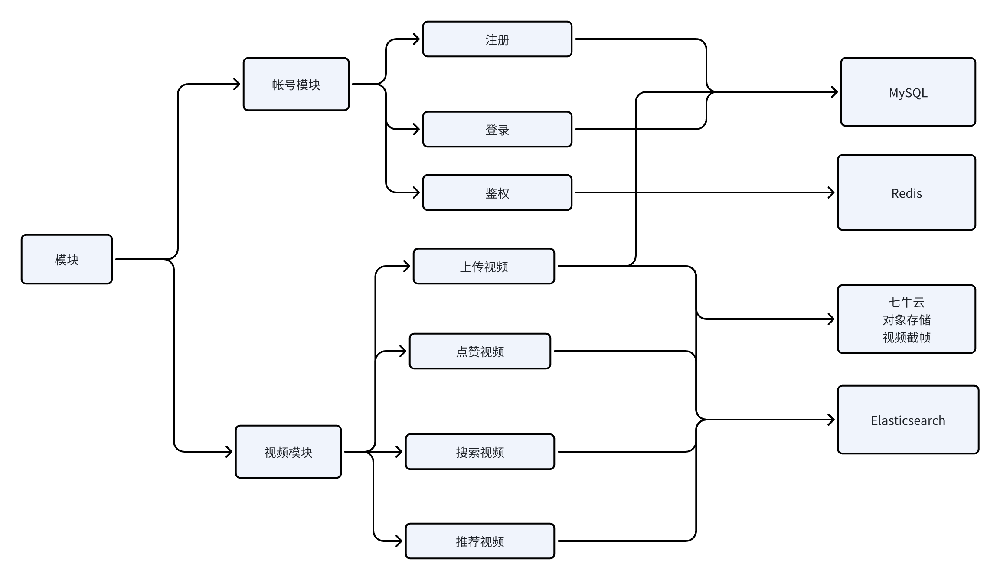

# qiniu-1024

基于web的短视频应用

## Feature

- 视频播放、暂停、进度条拖拽
- ­视频切换：可通过上下键翻看视频
- 帐号功能
- 视频上传功能
- 点赞功能
- 搜索功能
- 分类功能
- 推荐功能

## 架构  



## 前端webapp文档

[从这里阅读](webapp/README.md)

## API文档

[从这里阅读](doc/API文档.md)

## 推荐系统和搜索系统设计

[从这里阅读](doc/推荐和搜索系统设计文档.md)

## 测试和构建

### 首先准备好开发环境

Go >= 1.19

Npm

Vite

Docker

### 编译项目

```Bash
mkdir build

# server
cd server/src
# 第一次编译会很慢
go build -p <并行编译核心数量> -o server
mv server ../../build
# webapp
cd webapp
npm install
npm run build
mv dist/* ../build/static/
```

### 运行项目

#### 运行外部数据库和依赖：

#### 系统需要先设置好虚拟内存大小

修改 **/etc/sysctl.conf**的vm.max_map_count

```Bash
vm.max_map_count = 262144
```

```Bash
# 构建外部依赖的docker容器并运行（仅第一次创建容器时用）
docker compose -f docker/docker-compose.yaml up
# 删除外部依赖的docker容器
docker compose -f docker/docker-compose.yaml down

# 使用这条启动外部依赖服务
docker compose -f docker/docker-compose.yaml start
# 停止
docker compose -f docker/docker-compose.yaml stop
```

#### 获取elasticsearch秘钥和证书

```Bash
# 生成帐号秘钥
docker exec -it es-test /usr/share/elasticsearch/bin/elasticsearch-reset-password -u elastic
# 拷贝证书到本地
docker cp es-test:/usr/share/elasticsearch/config/certs/http_ca.crt .
```

将控制台打印的秘钥复制到***server.yml*** 对应位置中即可

#### 配置**[elasticsearch-analysis-ik](https://github.com/medcl/elasticsearch-analysis-ik/releases/download/v8.10.4/elasticsearch-analysis-ik-8.10.4.zip)**中文分词插件

```Bash
# 下载插件后，unzip解压文件
unzip elasticsearch-analysis-ik-8.10.4.zip -d ./elasticsearch-analysis-ik-8.10.4
# 将该目录拷贝到elasticsearch容器的plugins文件夹下
docker cp ./elasticsearch-analysis-ik-8.10.4 es-test:/usr/share/elasticsearch/plugins/elasticsearch-analysis-ik-8.10.4
# 添加执行权限
docker exec -it es-test chmod +x /usr/share/elasticsearch/plugins/elasticsearch-analysis-ik-8.10.4
# 重启容器
docker restart es-test
```

#### 为数据库建立表

[数据库需要提前准备的表](./数据库需要提前准备的表.md)

#### 将http_cat.crt移到Build目录

```Bash
mv http_ca.crt build/http_ca.crt
```

#### 在**build**文件夹内创建如图所示的***server.yml***配置文件

```YAML
server:
  # 服务器端口号
  port: 8080
object_storage:
  # 对象存储配置
  access_key: "7PYpaMsBSej4BoqCDwK0yVT80AMrTgxBo3e3T8pj"
  secret_key: "aAKQU6eoDE5TPY7NydeWZJ4_BCfaHwwdtrKWmVHq"
  bucket: "video1024"
  domain: "http://s318pb01g.hn-bkt.clouddn.com"
databases: 
  # 数据库
  mysql.video1024: 
    name: "video1024"
    host: "172.18.0.1"
    port: 3306
    username: "root"
    password: "123456"
  redis: 
    name: "redis"
    host: "172.18.0.1"
    port: 6380
  elastic:
    name: "elastic"
    host: "172.18.0.1"
    port: 9200
    username: "elastic"
    password: "i4i5iBA80TYaw53ioOc0"
```

需要自行修改数据库对应的***host，host***更改为docker创建的虚拟网卡的IP

可通过 **docker inspect 容器名 |grep -A 100 'Networks'** //查找容器的IP

### 运行服务端

```Bash
cd build
./server
```

通过http://localhost:8080/即可访问服务