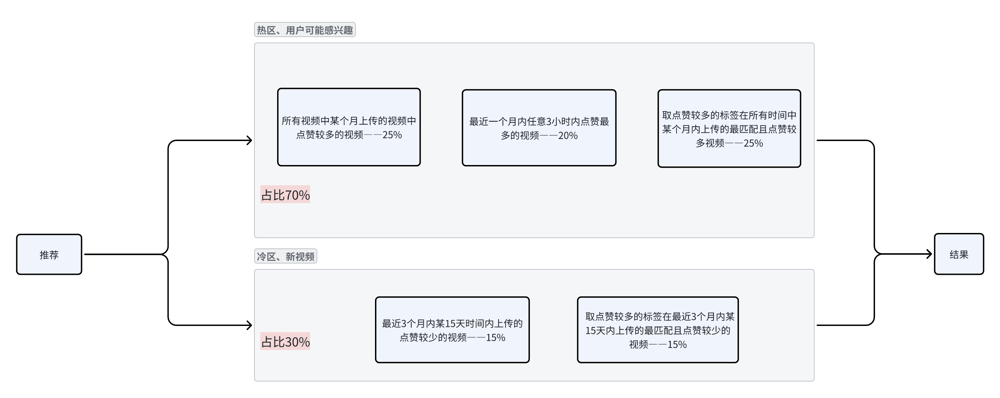

# Elasticsearch索引内容的文档定义

视频信息记录表（videoinfo）

| 参数名        | 类型   | 索引     | 说明                                                         |
| :------------ | :----- | :------- | :----------------------------------------------------------- |
| vid           | number | 关键字   | 视频的主键id                                                 |
| uploader      | number | 无       | 上传者的id，主要用来关联帐号信息                             |
| **subtitled** | string | 分词索引 | 视频的标题，**主要索引字段**                                 |
| **tags**      | string | 分词索引 | 视频的标签，由一系列标签和符号组成，例如"舞蹈,运动,探险,pretty girl,superman"，**主要索引字段** |
| likes         | number | 关键字   | 视频点赞数，推荐加权用                                       |
| upload_time   | long   | 关键字   | 上传时间，推荐加权用，毫秒时间戳                             |

点赞信息记录表（user_likes）

| 参数名    | 类型   | 索引   | 说明           |
| --------- | ------ | ------ | -------------- |
| vid       | number | 关键字 | 视频的主键id   |
| uid       | number | 关键字 | 点赞者的id     |
| like_time | long   | 无     | 点赞时间，毫秒 |

用户标签记录表(user_tags)

| 参数名 | 类型        | 索引   | 说明                                     |
| :----- | :---------- | :----- | :--------------------------------------- |
| uid    | number      | 关键字 | 用户id                                   |
| tags   | Json object | 无     | 用户点赞过的标签，{ "tag1":1, "tag2":2,} |

# 搜索系统

使用elasticsearch根据tags和subtitled进行搜索，根据tags进行视频分类

# 推荐算法

1. 所有视频中某个月上传的视频中点赞较多的视频——25%

2. 最近3个月内某15天时间内上传的点赞较少的视频——15%

3. 最近一个月内任意3小时内点赞最多的视频——20%

4. 根据用户点赞的视频的标签推荐

   - 取点赞较多的标签在所有时间中某个月内上传的最匹配且点赞较多视频——25%

   - 取点赞较多的标签在最近3个月内某15天内上传的最匹配且点赞较少的视频——15%

# 推荐系统流程 

